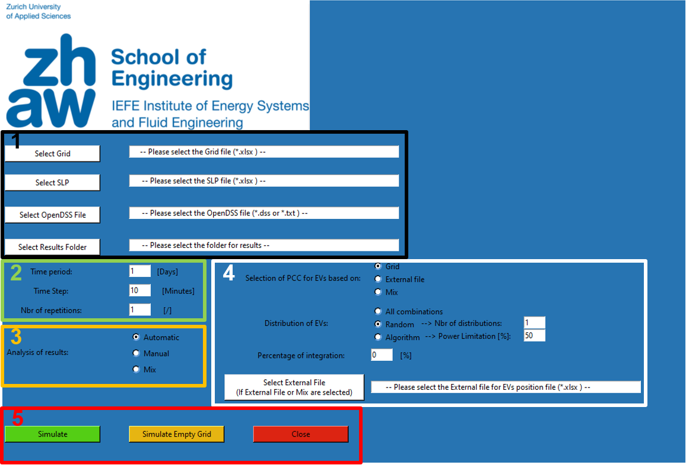

# EVLPG is an Electric Vehicle Load Profiles Generator for LV grid studies

This open-source module has been developed as a Master project at the Institute of Energy Systems and Fluid Engineering (IEFE) of the Zurich University of Applied Sciences (ZHAW).

Title: **Open-source module for the investigation of the impact of EVs in a LV grid**

Author: Giorgi Luca (luca.giorgi@bluewin.ch).

Supervisors:
            - Prof. Dr. Petr Korba
            - Dr. Artjoms Obusevs
            
Python 3.8 and OpenDSS 9.1.0.1 (64-bit built)
 
This is an open-source Python-based module focused on simulating the integration of electric vehicles in a low voltage grid. The goal of this module is to investigate on possible effects that the integration of electric vehicles could cause on the operability of the power network. The conditions of the electric grid are estimated by analyzing line loading, voltage values at the final customer, and the loading of transformers connected to main substations. The following tool enables modeling electric grids composed of basic grid elements such as lines, two-winding transformers, and loads. Moreover, it generates electric vehicle load profiles based on a statistical approach. Subsequently, these load profiles are distributed across the electric grid. Besides, it performs time-series simulations through a secondary software named OpenDSS. Results are then exported to be easily analyzed. Furthermore, the module is provided with a graphical user interface. 

This module is easy to use, but initial conditions must be defined to perform simulations.

1: External file are defined from here. The user should select: the file which contains a list with all elements in the grid as well as their parameters, the list that contains the Standard Load Profiles (SLPs), the OpenDSS script, and the folder where results will be saved.

2: In this part, time-series characteristics are defined. In particular: the timeframe of simulation in days, the time step in minutes, and the number of repetitions that define how many times the simulation – by keeping the same distribution of CF – should be repeated.

3: Define if results should be converted automatically by the module, manually by the user, or a mix of these options.

4: This part defines the methods of distribution of charging fleets across the grid.

5: Once defined all parameters, the simulation can start by pressing “Simulate”. It is also possible to simulate the grid without charging fleets in order to have a reference situation of the grid.

# ToDo

# ToDo
